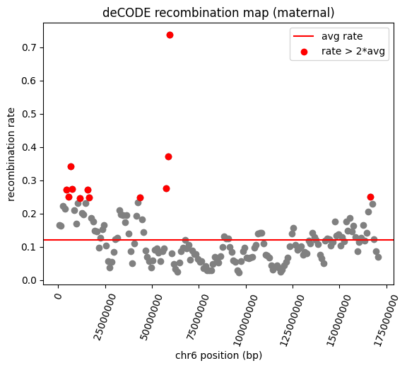
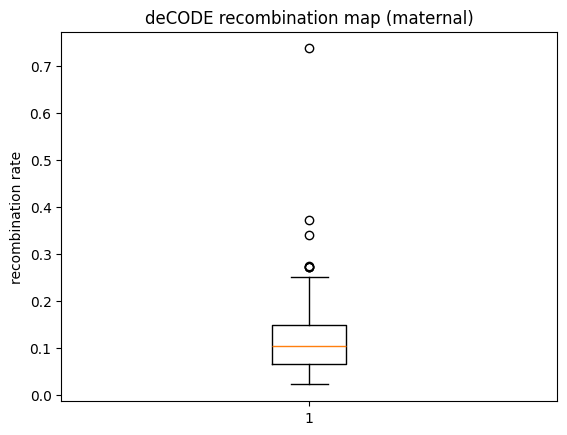
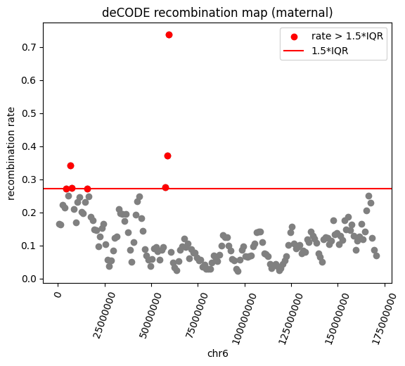

# Elixir-BH-2025

Download deCODE recombination maps including both crossover (CO) and non-crossover (NCO) recombination: https://doi.org/10.5281/zenodo.14025564


# Methods

Use [haploblock_breakpoints.ipynb](haploblock_breakpoints.ipynb)


# Results

We found 12 positions with high recombination rates defined as **rate > 2*average**:



| Position | Recombination rate (DSBs/Mb per meiosis) |
|----------|------------------------------------------|
| chr6:4500000 | 0.2726089060306549 |
| chr6:5500000 | 0.2507183849811554 |
| chr6:6500000 | 0.34163784980773926 |
| chr6:7500000 | 0.2730921804904938 |
| chr6:11500000 | 0.24522000551223755 |
| chr6:15500000 | 0.27179062366485596 |
| chr6:16500000 | 0.24810494482517242 |
| chr6:43500000 | 0.24928732216358185 |
| chr6:57500000 | 0.27551886439323425 |
| chr6:58500000 | 0.37233930826187134 |
| chr6:59500000 | 0.7373786568641663 |
| chr6:166500000 | 0.25078296661376953 |


Alternatively, we found 7 positions with high recombination rates defined as **rate > 1.5*IQR**:





| Position | Recombination rate (DSBs/Mb per meiosis) |
|----------|------------------------------------------|
| chr6:4500000 | 0.2726089060306549 |
| chr6:6500000 | 0.34163784980773926 |
| chr6:7500000 | 0.2730921804904938 |
| chr6:15500000 | 0.27179062366485596 |
| chr6:57500000 | 0.27551886439323425 |
| chr6:58500000 | 0.37233930826187134 |
| chr6:59500000 | 0.7373786568641663 |


# Python environment

Installed via [Python venv](https://docs.python.org/3/library/venv.html) with the following command:

```
python -m venv --system-site-packages ~/pyEnv_ElixirBH2025
source ~/pyEnv_ElixirBH2025/bin/activate
pip install --upgrade pip
pip install numpy pandas scipy matplotlib
```

Check [requirements.txt](requirements.txt) for versioning.


# References

1. Palsson, G., Hardarson, M.T., Jonsson, H. et al. Complete human recombination maps. Nature 639, 700–707 (2025). https://doi.org/10.1038/s41586-024-08450-5