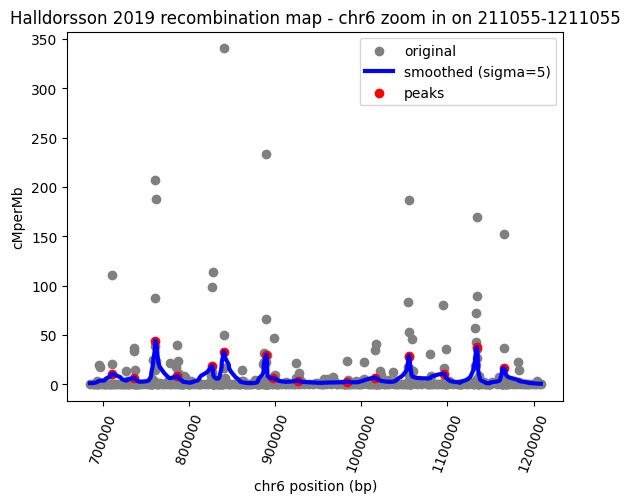

> Elixir BioHackathon November 3-7, 2025

# Elixir-BH-2025

# How to use this repo

```
git clone https://github.com/jedrzejkubica/Elixir-BH-2025.git
cd Elixir-BH-2025
```

# Data

We assume all data listed below is downloaded into `data/`:

1. deCODE recombination map from Palsson et al., 2024 including both crossover (CO) and non-crsossover (NCO) recombination: https://doi.org/10.5281/zenodo.14025564

2. high-resolution recombination map from Halldorsson et al., 2019 with empirically defined recombination rates:
```
wget https://www.science.org/doi/suppl/10.1126/science.aau1043/suppl_file/aau1043_datas3.gz
gzip -d aau1043_datas3.gz
```

File `aau1043_datas3` contains averaged maternal and paternal recombination rates.

3. 1000Genomes, HGSVC, Phase 3

Phased VCF file of chromosome 6 for Han Chinese in Beijing, China (https://www.internationalgenome.org/data-portal/population/CHB):
```
wget https://ftp.1000genomes.ebi.ac.uk/vol1/ftp/data_collections/1000_genomes_project/release/20190312_biallelic_SNV_and_INDEL/ALL.chr6.shapeit2_integrated_snvindels_v2a_27022019.GRCh38.phased.vcf.gz
```

and index file:
```
wget https://ftp.1000genomes.ebi.ac.uk/vol1/ftp/data_collections/1000_genomes_project/release/20190312_biallelic_SNV_and_INDEL/ALL.chr6.shapeit2_integrated_snvindels_v2a_27022019.GRCh38.phased.vcf.gz.tbi
```

and a TSV file with the list of samples in pupulations:
- CHB (113 samples): https://www.internationalgenome.org/data-portal/population/CHB
- PUR (150 samples): https://www.internationalgenome.org/data-portal/population/PUR
- GBR (107 samples): https://www.internationalgenome.org/data-portal/population/GBR

4. Reference sequence for chromosome 6 (GRCh38), must be bgzipped:
```
wget https://hgdownload.soe.ucsc.edu/goldenPath/hg38/chromosomes/chr6.fa.gz
gzip -d chr6.fa.gz
bgzip chr6.fa
```


# Workflow

TBD


## Exploring recombination maps

All code for exploring recombination maps is in [haploblock_breakpoints.ipynb](notebooks/haploblock_breakpoints.ipynb)

### Recombination map from Palsson et al., 2024

How the data looks:

| Chr | Position | map (cM) | cMperMb | DSBs/Mb per meiosis | deltaDSB | oNCO |
|-----|----------|----------|---------|---------------------|----------|------|
| chr1 | 500000 | 0.0465734638273716 | 0.051548998802900314 | 0.18732483685016632 | 0.9579851031303406 | 0.00024600245524197817 |
| chr1 | 1500000 | 0.05668618530035019 | 0.36985400319099426 | 0.23414182662963867 | 0.7754221558570862 | 0.0006765067810192704 |
| chr1 | 2500000 | 0.08809421956539154 | 1.2260290384292603 | 0.3768974542617798 | 0.5750330686569214 | 0.0022755227982997894 |
| chr1 | 3500000 | 0.07209863513708115 | 1.9589810371398926 | 0.3275741636753082 | 0.3099609315395355 | 0.0027675277087837458 |
| chr1 | 4500000 | 0.06319160014390945 | 2.5238749980926514 | 0.3032439053058624 | 0.1271921992301941 | 0.002952029462903738 |


Are map (cM), cMperMb, DSBs/Mb per meiosis, deltaDSB and oNCO correlated?


We used DSB rate (DSBs/Mb per meiosis) to find haploblock boundaries.

1) We found 12 positions with high recombination rates defined as **rate > 2*average**:


| Position | Recombination rate (DSBs/Mb per meiosis) |
|----------|------------------------------------------|
| chr6:4500000 | 0.2726089060306549 |
| chr6:5500000 | 0.2507183849811554 |
| chr6:6500000 | 0.34163784980773926 |
| chr6:7500000 | 0.2730921804904938 |
| chr6:11500000 | 0.24522000551223755 |
| chr6:15500000 | 0.27179062366485596 |
| chr6:16500000 | 0.24810494482517242 |
| chr6:43500000 | 0.24928732216358185 |
| chr6:57500000 | 0.27551886439323425 |
| chr6:58500000 | 0.37233930826187134 |
| chr6:59500000 | 0.7373786568641663 |
| chr6:166500000 | 0.25078296661376953 |


2) We found 7 positions with high recombination rates defined as **rate > 1.5*IQR**:


| Position | Recombination rate (DSBs/Mb per meiosis) |
|----------|------------------------------------------|
| chr6:4500000 | 0.2726089060306549 |
| chr6:6500000 | 0.34163784980773926 |
| chr6:7500000 | 0.2730921804904938 |
| chr6:15500000 | 0.27179062366485596 |
| chr6:57500000 | 0.27551886439323425 |
| chr6:58500000 | 0.37233930826187134 |
| chr6:59500000 | 0.7373786568641663 |

3) We found 6 positions with high recombination rates defined as **peaks after Gaussian smooting**:


| Position | Recombination rate (DSBs/Mb per meiosis) |
|----------|------------------------------------------|
| chr6:7500000 | 0.2730921804904938 |
| chr6:38500000 | 0.08716981112957001 |
| chr6:58500000 | 0.37233930826187134 |
| chr6:90500000 | 0.12601755559444427 |
| chr6:106500000 | 0.13935035467147827 |
| chr6:165500000 | 0.2063562124967575 |

For more information about Gaussian smoothing see: https://en.wikipedia.org/wiki/Gaussian_filter

We compared different sigma for Gaussian smoothing:


### Recombination map from Halldersson et al., 2019

We used cMperMb to generate haploblock boundaries.

1) We found 1398 positions with high recombination rates defined as **rate > 10*average**:

2) We found 11855 positions with high recombination rates defined as **rate > 1.5*IQR**.

3) We found 2287 positions with high recombination rates defined as **peaks after Gaussian smooting** (sigma=5). Zoom in on the first peak:



We compared different sigma for Gaussian smoothing:


The number of peaks found with different sigma:
| Sigma | Number of peaks |
|-------|-----------------|
| 1 | 8245 |
| 3 | 3579 |
| 5 | 2287 |
| 10 | 1210 |


## Run automated pipeline

#### 1. Generate haploblock boundaries for chr6 using the Halldorsson2019 recombination map:
```
python haploblock_boundaries.py --recombination_file data/Halldorsson2019/aau1043_datas3 --chr chr6 > data/haploblock_boundaries_chr6.tsv
```

See [haploblock_boundaries_chr6.tsv](data/haploblock_boundaries_chr6.tsv) for 1398 haploblock boundaries (high recombination rates defined as **rate > 10*average**).

#### 2. Generate phased VCFs and haploblock phased fasta files (1000Genomes phased VCF -> Haploblock phased VCFs -> Phased fasta files):
```
python haploblock_phased_sequences.py --boundaries_file data/haploblock_boundaries_chr6.tsv --samples_file data/igsr-chb.tsv.tsv --vcf data/ALL.chr6.shapeit2_integrated_snvindels_v2a_27022019.GRCh38.phased.vcf.gz --ref data/chr6.fa.gz --chr_map data/chr_map --chr 6 --out data/CHB/
```

This script uses bcftools and bgzip to extract regions corresponding to haploblock boundaries (--boundaries_file) from a population VCF file (--vcf).

NOTE: VCF file has "6" instead of "chr6", which is required by bcftools consensus, create file chr_map with one mapping per line (e.g., "6 chr6") and provide it by --chr_map.

Then it generates a consensus haploblock phased sequences for both haploids of each sample (e.g., `NA18531_chr6_region_711055-761032_hap1.fa`) by applying common variants (bcftools view `--min-af 0.05`) from previously generated VCF to reference sequence (--ref).

Testing: We generated haploblock phased sequences (format: sample_chr_region_start-end_hap1/2.fa) for all samples from the CBH, PUR and GBR populations for 5 random haploblocks of chromosome 6.

#### 3. Population-specific haploblock alignments ?

We use TWILIGHT (https://github.com/TurakhiaLab/TWILIGHT), it requires one fasta file with haploblock phased sequences

NOTE: We previously generated haploblock phased sequences, e.g., `NA18531_chr6_region_711055-761032_hap1.fa` with headers like ">chr6:711055-761032", but each sequence in the merged fasta file must have a unique header, this can be done with:
```
mkdir data/CHB/haploblock_phased_seq_random5
mv data/CHB/NA* data/CHB/haploblock_phased_seq_random5/.  ## or HG* for GBR
# generates one fasta file per region in output dir
mkdir data/CHB/haploblock_phased_seq_random5/haploblock_phased_seq_merged
./merge_fasta_per_region.sh data/CHB/haploblock_phased_seq_random5 data/CHB/haploblock_phased_seq_random5/haploblock_phased_seq_merged
LOG: Merged FASTA written to: data/CHB_chr6_random10/CHB_chr6_random5_merged.fa
```

```
tar -zcvf data/CHB/haploblock_phased_seq_random5/CHB_haploblock_phased_seq_merged.tar.gz data/CHB/haploblock_phased_seq_random5/haploblock_phased_seq_merged
```

```
snakemake --cores 8 --config TYPE=n SEQ=/home/shadeform/Elixir-BH-2025/data/haploblock_phased_seq_random5/CHB_chr6_random10_merged.fa OUT=CHB_chr6_random5.aln
```

see CHB_chr6_random5.aln


#### 4. Population-specific haploblock clusters

TBD


# Dependencies

Install samtools, bcftools, htslib (https://www.htslib.org/), all must be simlinked in `/usr/bin`. See [install_dependencies.txt](install_dependencies.txt).

Install TWILIGHT (https://github.com/TurakhiaLab/TWILIGHT)

## Python environment

Installed via [Python venv](https://docs.python.org/3/library/venv.html) with the following command:

```
python -m venv --system-site-packages ~/pyEnv_ElixirBH2025
source ~/pyEnv_ElixirBH2025/bin/activate
pip install --upgrade pip
pip install numpy pandas scipy matplotlib
```

Check [requirements.txt](requirements.txt) for versioning.


# References

1. Palsson, G., Hardarson, M.T., Jonsson, H. et al. Complete human recombination maps. Nature 639, 700–707 (2025). https://doi.org/10.1038/s41586-024-08450-5

2. Bjarni V. Halldorsson et al., Characterizing mutagenic effects of recombination through a sequence-level genetic map. Science363,eaau1043 (2019). DOI:10.1126/science.aau1043

3. Yu-Hsiang Tseng, Sumit Walia, Yatish Turakhia, "Ultrafast and ultralarge multiple sequence alignments using TWILIGHT", Bioinformatics, Volume 41, Issue Supplement_1, July 2025, Pages i332–i341, doi: 10.1093/bioinformatics/btaf212